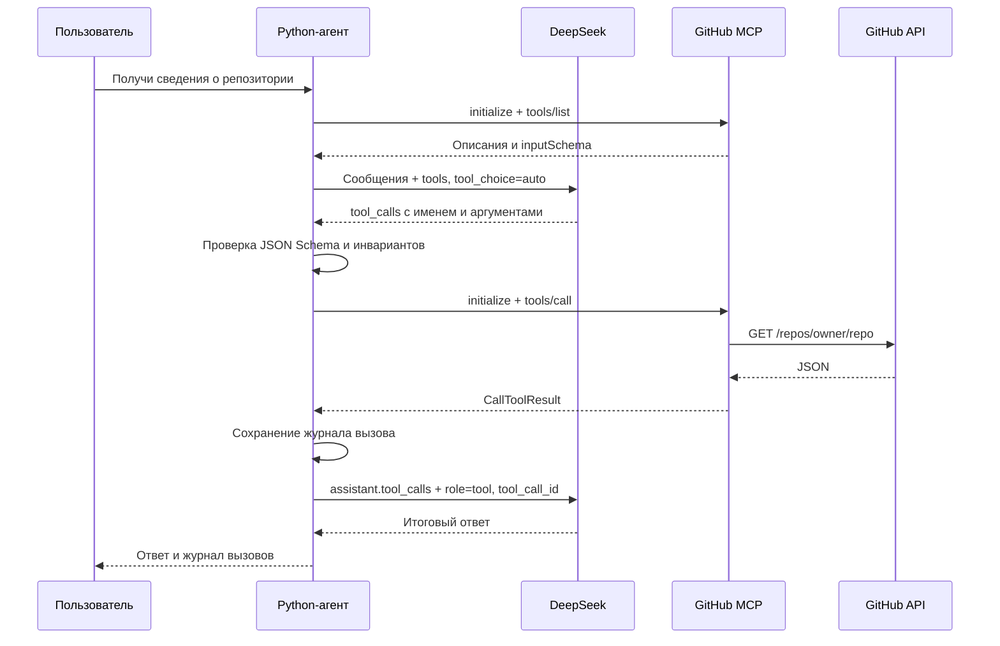

# MCP: каталог и первый инструмент — дни 16–17

Агент получает каталог MCP, передаёт модели имена, описания и JSON Schema,
выполняет выбранные моделью инструменты и отправляет результаты обратно модели.
Пользователь получает ответ на основе этих данных и может раскрыть вызовы в чате.



Модель выбирает инструмент по схеме, приложение исполняет его через MCP SDK.
Протоколы: [DeepSeek Tool Calls](https://api-docs.deepseek.com/guides/tool_calls/)
и [MCP tools](https://modelcontextprotocol.io/specification/2025-11-25/server/tools).

## Запуск своего сервера и чата

Команды из корня проекта с активным Python-окружением:

```shell
python -m pip install -r requirements.txt
python MCPServerExample/server.py
```

Сервер запускается отдельно на `http://127.0.0.1:8000/mcp`. Настройки читаются
из `MCPServerExample/.env`. Для публичных репозиториев GitHub-токен необязателен;
для приватных задайте серверу `GITHUB_TOKEN` с правами чтения нужных репозиториев.

В корневом `.env` агента укажите `API_KEY` DeepSeek. Если сервер использует
авторизацию, добавьте туда же `MCP_ACCESS_TOKEN` с тем же значением, что на сервере.
Не заменяйте существующие `.env`; добавьте переменные и перезапустите процессы.
Переменные окружения имеют приоритет над файлами.

В другом терминале:

```shell
python -m llm_agent.web
```

Откройте [чат](http://127.0.0.1:8080), затем **MCP → Добавить MCP**:

| Поле | Локальный сервер | Сервер на VPS |
| --- | --- | --- |
| Название | `Мой GitHub` | `Мой GitHub VPS` |
| URL MCP-сервера | `http://127.0.0.1:8000/mcp` | `https://mcp.example.com/mcp` |
| Переменная окружения с токеном | Пусто без авторизации; иначе `MCP_ACCESS_TOKEN` | `MCP_ACCESS_TOKEN` |
| Использовать в чате | Включить | Включить |

Нажмите **Сохранить MCP → Get tools**. Ожидается семь инструментов с описаниями
и схемами. Для этой проверки `API_KEY` не нужен. Кнопка проверяет соединение
и каталог, без исполнения инструментов. При отправке сообщения агент сам
получает свежий каталог включённых серверов.

Примеры сообщений:

- «Получи через MCP сведения о репозитории octocat/Hello-World: основную ветку,
  количество звёзд и ссылку».
- «Покажи 5 последних открытых issues в python/cpython, с номерами и ссылками».
- «Прочитай README.md в репозитории modelcontextprotocol/python-sdk и кратко объясни назначение».

В чате появятся сворачиваемые блоки с инструментами, аргументами, результатами
и статусами. Они сохраняются до следующего обращения к модели, поэтому доступны
и при ошибке формирования окончательного ответа.

Настройки MCP общие: `data/conversations/mcp.sqlite3` или `<--data-dir>/mcp.sqlite3`.
Старые подключения и новые записи по умолчанию выключены для модели. Их можно
проверить через **Get tools**, включить, отредактировать или удалить. Изменения
применяются со следующего сообщения.

## VPS и токены

Агент принимает HTTPS для удалённого подключения. HTTP разрешён на localhost,
`127.0.0.1` и `[::1]`. На VPS используйте HTTPS reverse proxy с внутренним портом
8000. Пример Caddy и systemd — в [инструкции сервера](MCPServerExample/README.md#настройка-удалённого-доступа).

Подключения к `localhost`, `127.0.0.1` и `::1` идут напрямую, без прокси
из окружения или настроек Windows. Для удалённых адресов настройки прокси
сохраняются. Это предотвращает HTTP 503 от прокси при обращении к локальному
серверу. После обновления клиента перезапустите веб-приложение агента.

Два независимых секрета:

- `GITHUB_TOKEN`: только на MCP-сервере, для обращения к GitHub API.
- `MCP_ACCESS_TOKEN`: на сервере и у агента, заголовок `Authorization: Bearer …`.

В SQLite сохраняется только **имя** переменной с MCP-токеном. Авторизационные
заголовки не включаются в схемы, сообщения модели или журнал вызовов. Данные
инструмента передаются DeepSeek и сохраняются в диалоге. Включайте серверы,
инструменты которых разрешаете агенту использовать.

Официальный GitHub MCP из дня 16 также доступен: URL
`https://api.githubcopilot.com/mcp/`, переменная `GITHUB_PERSONAL_ACCESS_TOKEN`.
В этом варианте агент обращается непосредственно к GitHub MCP; прототип не нужен.
Каталог и права инструментов определяются этим сервером.

## CLI и Python

Через модель, с выводом аргументов, результата и окончательного ответа:

```shell
python -m llm_agent --mcp-url http://127.0.0.1:8000/mcp --user "Получи сведения о репозитории octocat/Hello-World"
python -m llm_agent --mcp-url https://mcp.example.com/mcp --mcp-token-env MCP_ACCESS_TOKEN --user "Покажи 5 открытых issues в python/cpython"
```

CLI использует явно заданный `--mcp-url`, а не веб-настройки. Каталог отдельно от LLM:

```shell
python -m llm_agent.mcp_client --url http://127.0.0.1:8000/mcp --token-env=""
```

Клиент можно использовать отдельно от UI и модели:

```python
import asyncio
from llm_agent.mcp_client import get_tools, call_tool
from llm_agent.mcp_config import MCPServer

server = MCPServer("github", "Мой GitHub", "http://127.0.0.1:8000/mcp", enabled=True)
catalog = asyncio.run(get_tools(server))
result = asyncio.run(call_tool(server, "get_repository", {"owner": "octocat", "repo": "Hello-World"}))
print(result.is_error, result.structured_content)
```

Подключение к агенту: `Agent(token, mcp_servers=(server,))`, затем
`agent.request("Получи сведения о репозитории octocat/Hello-World")` и `agent.close()`.
`RequestResult.tool_calls` содержит выполненные вызовы. Если приложение использует
asyncio, запускайте синхронный Agent в рабочем потоке; веб-сервис делает это сам.

## Реализация и ограничения

- SDK `mcp==2.2.0`: `httpx2`, два потока Streamable HTTP, snake_case поля Python
  (`input_schema`, `structured_content`, `is_error`).
- Каталог загружается один раз на пользовательский этап, с обработкой страниц.
  Вызовы открывают новые сессии; stateless сервер не требует сохранения сессии.
  HTTP-клиенты закрываются, операция MCP ограничена 30 секундами.
- Имена нормализуются под API модели и связываются с исходным именем и сервером.
  Схема приходит от MCP, ручного списка инструментов в агенте нет.
- Некорректные аргументы, неизвестные инструменты и `is_error` передаются модели
  как ошибки для исправления или объяснения. Ошибка загрузки каталога останавливает
  запрос с сообщением; подключение можно исправить или выключить.
- Максимум 5 раундов и 10 вызовов на запрос. При достижении лимита модель должна
  дать итог из полученных данных; попытка продолжить вызовы останавливается.
- Структурированный результат не дублируется текстовой копией. Результаты больше
  20 000 символов обрезаются с `truncated=true`; нетекстовые блоки заменяются
  пометкой. Для больших файлов/выдач требуется более узкий запрос.
- Инварианты проверяются перед исполнением предложенных вызовов и сохранением
  финала. На этапе planning инструменты не используются. Запросы facts, summary
  и генерации мета-промпта также выполняются без инструментов.
- Исправление JSON ответа задачи использует полученные результаты без повторного
  исполнения инструментов. Все промежуточные ответы модели учитываются в токенах.
- В рабочую историю сохраняются запрос и итоговый ответ. Протокольные сообщения
  `tool` живут в текущем запросе; журнал сохраняется отдельно в полной веб-ленте.
  Стратегии window/facts/summary не разрывают пары `tool_call_id`.

Сервер предоставляет чтение GitHub. Планировщик, фоновые задачи, OAuth, stdio,
старый SSE-транспорт и отдельная оркестрация будущих дней не реализованы.

## Проверка

```shell
python -m unittest tests.test_mcp_agent tests.test_mcp_integration tests.test_mcp_client tests.test_mcp_config tests.test_mcp_web -v
python -m unittest discover -s tests -q
cd MCPServerExample
python -m unittest discover -s tests -q
```

Интеграционный тест запускает настоящий GitHub MCP на свободном HTTP-порту
с Bearer-авторизацией. Подменяются только DeepSeek и GitHub API. Проверяется путь
«схема → выбор инструмента → HTTP MCP-вызов → результат модели → сохранённый ответ»,
журнал после перезапуска и закрытие соединений. Тесты не требуют сети и токенов.
Реальные доступ к GitHub и выбор инструмента DeepSeek проверяются запросом в чате.
