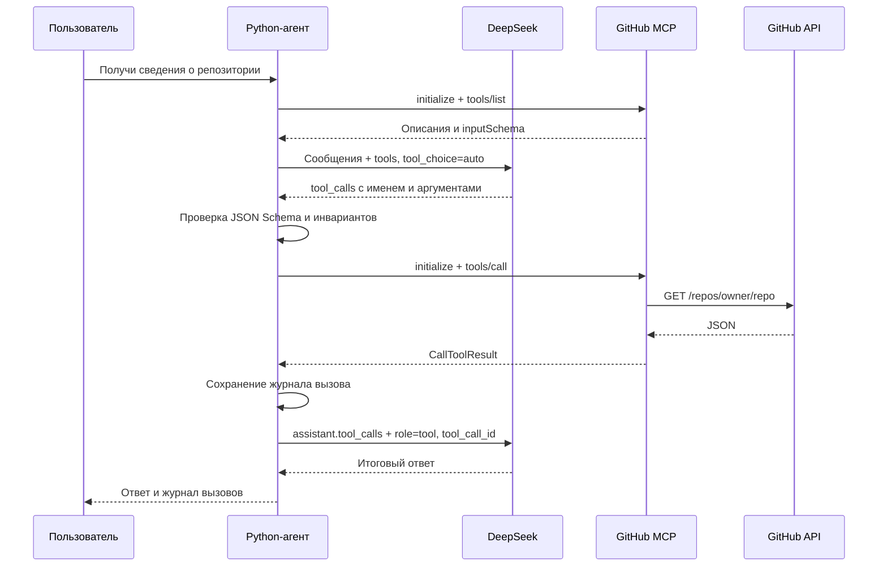

# MCP: каталог, инструменты, композиция и оркестрация — дни 16–20

Агент получает каталог MCP, передаёт модели имена, описания и JSON Schema,
выполняет выбранные моделью инструменты и отправляет результаты обратно модели.
Пользователь получает ответ на основе этих данных и может раскрыть вызовы в чате.

Работа с несколькими MCP-серверами из обычного промпта и демонстрационный сценарий
**GitHub → NIST NVD → Telegram** описаны в [ORCHESTRATION.md](ORCHESTRATION.md).


```mermaid
sequenceDiagram
    participant U as Пользователь
    participant A as Python-агент
    participant L as DeepSeek
    participant M as GitHub MCP
    participant G as GitHub API
    U->>A: Получи сведения о репозитории
    A->>M: initialize + tools/list
    M-->>A: Описания и inputSchema
    A->>L: Сообщения + tools, tool_choice=auto
    L-->>A: tool_calls с именем и аргументами
    A->>A: Проверка JSON Schema и инвариантов
    A->>M: initialize + tools/call
    M->>G: GET /repos/owner/repo
    G-->>M: JSON
    M-->>A: CallToolResult
    A->>A: Сохранение журнала вызова
    A->>L: assistant.tool_calls + role=tool, tool_call_id
    L-->>A: Итоговый ответ
    A-->>U: Ответ и журнал вызовов
```

Модель выбирает инструмент по схеме, приложение исполняет его через MCP SDK.
Протоколы: [DeepSeek Tool Calls](https://api-docs.deepseek.com/guides/tool_calls/)
и [MCP tools](https://modelcontextprotocol.io/specification/2025-11-25/server/tools).

## Запуск своего сервера и чата

Команды из корня проекта с активным Python-окружением:

```shell
python -m pip install -r requirements.txt
python MCPServerExample/server.py
```

Сервер запускается отдельно на `http://127.0.0.1:8000/mcp`. Настройки читаются
из `MCPServerExample/.env`. Для публичных репозиториев GitHub-токен необязателен;
для приватных задайте серверу `GITHUB_TOKEN` с правами чтения нужных репозиториев.

В корневом `.env` агента укажите `API_KEY` DeepSeek. Если сервер использует
авторизацию, добавьте туда же `MCP_ACCESS_TOKEN` с тем же значением, что на сервере.
Не заменяйте существующие `.env`; добавьте переменные и перезапустите процессы.
Переменные окружения имеют приоритет над файлами.

В другом терминале:

```shell
python -m llm_agent.web
```

Откройте [чат](http://127.0.0.1:8080), затем **MCP → Добавить MCP**:

| Поле | Локальный сервер | Сервер на VPS |
| --- | --- | --- |
| Название | `Мой GitHub` | `Мой GitHub VPS` |
| URL MCP-сервера | `http://127.0.0.1:8000/mcp` | `https://mcp.example.com/mcp` |
| Переменная окружения с токеном | Пусто без авторизации; иначе `MCP_ACCESS_TOKEN` | `MCP_ACCESS_TOKEN` |
| Использовать в чате | Включить | Включить |

Нажмите **Сохранить MCP → Get tools**. Ожидается десять инструментов с описаниями
и схемами. Для этой проверки `API_KEY` не нужен. Кнопка проверяет соединение
и каталог, без исполнения инструментов. При отправке сообщения агент сам
получает свежий каталог включённых серверов.

Примеры сообщений:

- «Получи через MCP сведения о репозитории octocat/Hello-World: основную ветку,
  количество звёзд и ссылку».
- «Покажи 5 последних открытых issues в python/cpython, с номерами и ссылками».
- «Прочитай README.md в репозитории modelcontextprotocol/python-sdk и кратко объясни назначение».

В чате появятся сворачиваемые блоки с инструментами, аргументами, результатами
и статусами. Они сохраняются до следующего обращения к модели, поэтому доступны
и при ошибке формирования окончательного ответа.

Настройки MCP общие: `data/conversations/mcp.sqlite3` или `<--data-dir>/mcp.sqlite3`.
Старые подключения и новые записи по умолчанию выключены для модели. Их можно
проверить через **Get tools**, включить, отредактировать или удалить. Изменения
применяются со следующего сообщения.

## VPS и токены

Агент принимает HTTPS для удалённого подключения. HTTP разрешён на localhost,
`127.0.0.1` и `[::1]`. На VPS используйте HTTPS reverse proxy с внутренним портом
8000. Пример Caddy и systemd — в [инструкции сервера](MCPServerExample/README.md#настройка-удалённого-доступа).

Подключения к `localhost`, `127.0.0.1` и `::1` идут напрямую, без прокси
из окружения или настроек Windows. Для удалённых адресов настройки прокси
сохраняются. Это предотвращает HTTP 503 от прокси при обращении к локальному
серверу. После обновления клиента перезапустите веб-приложение агента.

Независимые секреты:

- `GITHUB_TOKEN`: только на MCP-сервере, для обращения к GitHub API.
- `MCP_ACCESS_TOKEN`: на сервере и у агента, заголовок `Authorization: Bearer …`.
- `LLM_API_KEY`: только на MCP-сервере, для LLM-суммаризации. Модель и адрес API
  настраиваются через `LLM_MODEL` и `LLM_BASE_URL`.

В SQLite сохраняется только **имя** переменной с MCP-токеном. Авторизационные
заголовки не включаются в схемы, сообщения модели или журнал вызовов. Данные
инструмента передаются DeepSeek и сохраняются в диалоге. Включайте серверы,
инструменты которых разрешаете агенту использовать.

Официальный GitHub MCP из дня 16 также доступен: URL
`https://api.githubcopilot.com/mcp/`, переменная `GITHUB_PERSONAL_ACCESS_TOKEN`.
В этом варианте агент обращается непосредственно к GitHub MCP; прототип не нужен.
Каталог и права инструментов определяются этим сервером.

## CLI и Python

Через модель, с выводом аргументов, результата и окончательного ответа:

```shell
python -m llm_agent --mcp-url http://127.0.0.1:8000/mcp --user "Получи сведения о репозитории octocat/Hello-World"
python -m llm_agent --mcp-url https://mcp.example.com/mcp --mcp-token-env MCP_ACCESS_TOKEN --user "Покажи 5 открытых issues в python/cpython"
```

CLI использует те же настройки MCP, что и веб, из `mcp.sqlite3` общего
каталога диалогов. `--mcp-url` сохраняет включённый сервер с ID `cli`, заменяя
его предыдущую конфигурацию; `--mcp-token-env` сохраняет имя переменной токена.
Этот сервер будет доступен и последующим запросам в CLI и веб. Для другого
каталога укажите `--data-dir` в обоих интерфейсах. При выборе диалога по пути
CLI использует настройки из каталога его файла. Веб-сервер запускать не нужно.

Запрос без `--conversation` создаёт новый диалог. Для продолжения используйте
`--conversation <ID>` с ID из вывода CLI (замените `<ID>`, убрав угловые скобки).
Каталог отдельно от LLM:

```shell
python -m llm_agent.mcp_client --url http://127.0.0.1:8000/mcp --token-env=""
```

Клиент можно использовать отдельно от UI и модели:

```python
import asyncio
from llm_agent.mcp_client import get_tools, call_tool
from llm_agent.mcp_config import MCPServer

server = MCPServer("github", "Мой GitHub", "http://127.0.0.1:8000/mcp", enabled=True)
catalog = asyncio.run(get_tools(server))
result = asyncio.run(call_tool(server, "get_repository", {"owner": "octocat", "repo": "Hello-World"}))
print(result.is_error, result.structured_content)
```

Подключение к агенту: `Agent(token, mcp_servers=(server,))`, затем
`agent.request("Получи сведения о репозитории octocat/Hello-World")` и `agent.close()`.
`RequestResult.tool_calls` содержит выполненные вызовы. Если приложение использует
asyncio, запускайте синхронный Agent в рабочем потоке; веб-сервис делает это сам.

## Композиция инструментов — день 19

Один запрос пользователя запускает цепочку на одном MCP-сервере:
`search_repositories → summarize → save_to_file`. Порядок выбирает модель по
описаниям инструментов; в Python нет зашитого сценария поиска или списка шагов.
Вместо поиска можно использовать `list_commits`, `list_issues` и другие источники.

Установите зависимости сервера (`python -m pip install -r MCPServerExample/requirements.txt`),
добавьте в **серверный** `MCPServerExample/.env` и перезапустите сервер:

```dotenv
LLM_API_KEY=ваш_ключ
LLM_BASE_URL=https://api.deepseek.com
LLM_MODEL=deepseek-chat
MCP_OUTPUT_DIR=output
```

Это отдельный клиент на основе [OpenAI Python SDK](https://developers.openai.com/api/reference/python),
использующий совместимый Chat Completions API. Секрет не передаётся агенту.
У агента по-прежнему свой `API_KEY` в корневом `.env`. Суммаризатор получает исходные
данные от агента, обращается к LLM и возвращает `{"summary": "..."}`.
Без `LLM_API_KEY` каталог, GitHub-инструменты и сохранение продолжают работать;
только `summarize` возвращает понятную ошибку настройки.

Пример запроса в чате:

> Найди 5 репозиториев GitHub по запросу language:python stars:>10000,
> суммаризуй полученные данные через summarize на русском и сохрани сводку
> в python-repositories.txt через save_to_file.

Либо из CLI:

```shell
python -m llm_agent --mcp-url http://127.0.0.1:8000/mcp --user "Получи 5 последних коммитов python/cpython, суммаризуй через summarize и сохрани сводку в commits.txt через save_to_file"
```

В веб-чате видны пронумерованные вызовы с аргументами и статусами, а после
сохранения — кнопка **Скачать python-repositories.txt**. Файл содержит точный текст
сводки в UTF-8. Сервер хранит его в `MCP_OUTPUT_DIR/<уникальный ID>/<имя>.txt`
и возвращает содержимое как MCP embedded resource, а также имя, размер и SHA-256.
Относительный `MCP_OUTPUT_DIR` отсчитывается от каталога сервера.
Вложение сохраняется в истории агента и скачивается после перезапуска чата даже
при выключенном сервере. `file://` URI указывает на машину MCP-сервера;
для скачивания веб использует уже полученные байты, без чтения этого пути.
CLI выводит метаданные файла; его содержимое также доступно в сохранённой истории.

### Передача данных без перепечатывания моделью

Агент расширяет схемы параметров возможностью сослаться на успешный предыдущий
вызов текущего запроса. Каждый доступный результат содержит готовый `result_ref`
с настоящим ID вызова; эта ссылка остаётся видимой даже при обрезанном preview.
Модель копирует её, при необходимости меняя только `pointer`.
Например, после `tool_call_id=search-call` модель вызывает
`summarize` с аргументами:

```json
{"data": {"$mcp_result": "search-call", "pointer": "/data"}}
```

После `tool_call_id=summary-call` аргументы сохранения:

```json
{"content": {"$mcp_result": "summary-call", "pointer": "/data/summary"}, "filename": "summary.txt"}
```

`pointer` — JSON Pointer в полном результате агента: `/data` для structuredContent,
`/content/0/text` для обычного текста. Ссылку можно использовать вместо любого
верхнеуровневого аргумента. Агент подставляет значение без изменений и затем
проверяет исходную JSON Schema сервера. На сервер уходят обычные данные, без ссылок.
В журнале остаются ссылки с идентификаторами источников, чтобы проследить цепочку.
Зависимые вызовы выполняются в разных раундах; модель получает результат перед
выбором следующего шага. Ссылки на ошибки, неизвестные вызовы, вызовы того же раунда
или другого пользовательского запроса не исполняются.

`$mcp_result` содержит ID конкретного вызова (`call_…`), а не имя функции
(`mcp_summarize_…`). Если модель всё же передала имя функции из каталога,
агент принимает его только при единственном предыдущем вызове этой функции
и доступном успешном результате. При нескольких попытках имя неоднозначно:
агент не выбирает последний или старый успешный результат автоматически.
Ошибка содержит `available_results` с точными ссылками; модель может исправить
только зависимый шаг, не повторяя поиск или суммаризацию.

Полные результаты до 1 000 000 символов хранятся в памяти до конца текущего запроса;
модели по-прежнему показывается лишь начало длинного результата. Поэтому данные
больше 20 000 символов можно передать дальше без потерь. У серверных инструментов
свой предел: вход суммаризации и содержимое TXT до 200 000 символов. Превышение
возвращается как ошибка, без молчаливой обрезки. Если шаг завершился ошибкой,
модель должна исправить запрос или сообщить причину остановки, а не выдавать
ошибку за успешную сводку. Финальное решение о продолжении принимает модель.

## Реализация и ограничения

- SDK `mcp==2.2.0`: `httpx2`, два потока Streamable HTTP, snake_case поля Python
  (`input_schema`, `structured_content`, `is_error`).
- Каталог загружается один раз на пользовательский этап, с обработкой страниц.
  Вызовы открывают новые сессии; stateless сервер не требует сохранения сессии.
  HTTP-клиенты закрываются; каталог ограничен 30 секундами, вызов — 90 секундами.
  Серверная суммаризация ограничена 60 секундами, без автоматических повторов.
- Имена нормализуются под API модели и связываются с исходным именем и сервером.
  Схема приходит от MCP, ручного списка инструментов в агенте нет.
- Некорректные аргументы, неизвестные инструменты и `is_error` передаются модели
  как ошибки для исправления или объяснения. Ошибка загрузки каталога останавливает
  запрос с сообщением; подключение можно исправить или выключить.
- Максимум 16 раундов и 40 вызовов на запрос. При достижении лимита модель должна
  дать итог из полученных данных; попытка продолжить вызовы останавливается.
- Структурированный результат не дублируется текстовой копией. Результаты больше
  20 000 символов обрезаются с `truncated=true`; нетекстовые блоки заменяются
  пометкой. Полные данные для цепочки доступны через `$mcp_result` в указанных
  выше пределах; TXT-вложения хранятся отдельно от обрезаемого представления.
- Инварианты проверяются перед исполнением предложенных вызовов, включая
  подставленные данные ссылок, и сохранением финала. На этапе planning инструменты
  не используются. Служебные запросы facts, сжатия истории
  и генерации мета-промпта также выполняются без инструментов.
- Исправление JSON ответа задачи использует полученные результаты без повторного
  исполнения инструментов. Все промежуточные ответы модели учитываются в токенах.
- В рабочую историю сохраняются запрос и итоговый ответ. Протокольные сообщения
  `tool` живут в текущем запросе; журнал сохраняется отдельно в полной веб-ленте.
  Стратегии window/facts/summary не разрывают пары `tool_call_id`.

Сервер предоставляет чтение GitHub, LLM-суммаризацию и сохранение TXT.
Расписание и наблюдения агента описаны в [SCHEDULING.md](SCHEDULING.md).
OAuth, stdio и старый SSE-транспорт не поддерживаются.

## Проверка

```shell
python -m unittest tests.test_mcp_agent tests.test_mcp_integration tests.test_mcp_client tests.test_mcp_config tests.test_mcp_web -v
python -m unittest tests.test_mcp_results tests.test_mcp_pipeline_integration tests.test_tool_events tests.test_web -v
python -m unittest discover -s tests -q
cd MCPServerExample
python -m unittest discover -s tests -q
```

Интеграционный тест запускает настоящий GitHub MCP на свободном HTTP-порту
с Bearer-авторизацией. Подменяются только DeepSeek и GitHub API. Проверяется путь
«схема → выбор инструмента → HTTP MCP-вызов → результат модели → сохранённый ответ»,
журнал после перезапуска и закрытие соединений. Тесты не требуют сети и токенов.
Реальные доступ к GitHub и выбор инструмента DeepSeek проверяются запросом в чате.

Тест композиции также подменяет серверный LLM API: одним запросом выполняет
поиск → сводку → запись через настоящий HTTP MCP. Проверяет передачу полной
выдачи за пределами preview, точные аргументы на проводе, байты TXT, SHA-256,
вложение и историю после перезапуска. Отдельный сценарий проверяет ошибку
суммаризации без последующего сохранения. Тесты не обращаются к платным API;
самостоятельный выбор цепочки реальной моделью проверяется приведённым запросом.
