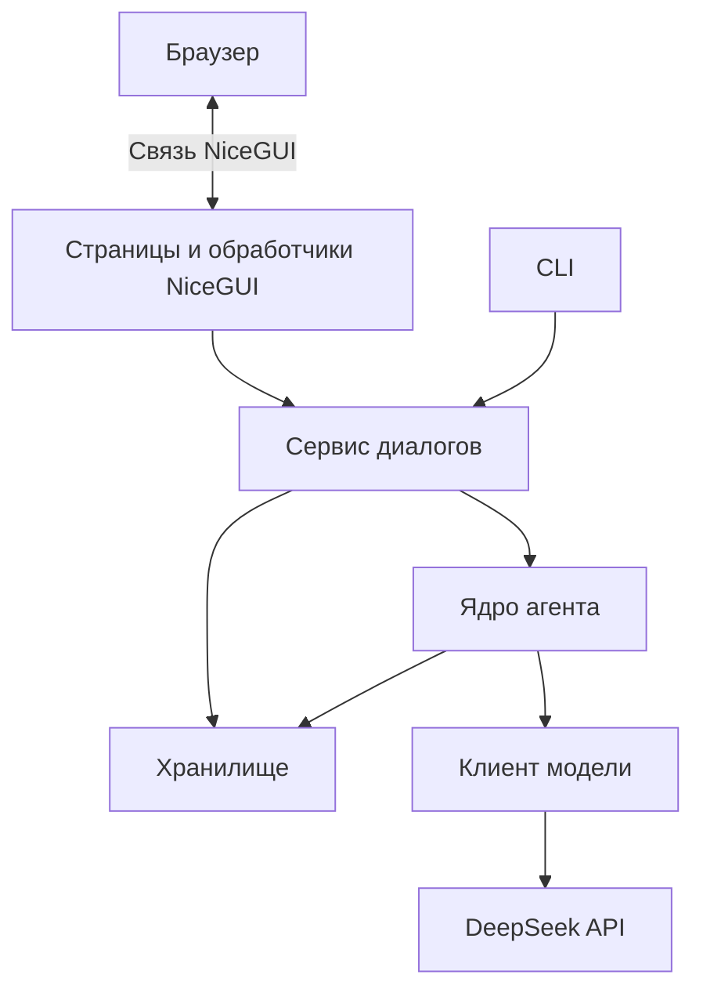

# План реализации чата на NiceGUI и адаптации агента

Дата: 15 сентября 2026 года. Статус: план, реализация ещё не начата.

План опирается на [описание текущей функциональности](AGENT_FUNCTIONALITY.md). Принятое архитектурное решение: один Python-сервер, NiceGUI для интерфейса, обычные вызовы Python между интерфейсом и прикладной логикой. Существующий CLI сохраняется.

## 1. Цель и границы

Создать удобный чат с навигацией по диалогам, настройками, просмотром памяти и статистики. Сделать ядро агента пригодным для любого будущего интерфейса, включая CLI, без зависимости от NiceGUI.

Разработка разделяется на два результата:

- **Минимальная рабочая версия:** обычный чат, сохранение полной переписки и настроек, переключение диалогов, неблокирующая отправка, понятные ошибки и восстановление страницы.
- **Перенос существующих возможностей:** мета-промптинг, все режимы контекста, память, ветки/checkpoints и подробная статистика.

Streaming, отмена, редактор памяти, регенерация ответов и инструменты агента — отдельные расширения. Их отсутствие не блокирует первую рабочую версию. Пользовательский режим JSON Schema не считается готовой возможностью: текущий код отправляет только тип формата без самой схемы.

Рабочее допущение для первой версии: локальное приложение для одного пользователя, допускающее несколько вкладок браузера. Публичное размещение и несколько пользователей требуют отдельного проектирования доступа.

## 2. Архитектура одного сервера



Ветви к хранилищу отражают разные операции: сервис управляет диалогами и запусками, агент сохраняет результаты этапов через согласованный интерфейс хранения. Дублировать сохранение одной пары сообщений одновременно в сервисе и агенте нельзя.

| Слой | Обязанности | Граница |
|---|---|---|
| UI | Компоненты, ввод, навигация, отображение событий и ошибок | Не собирает промпты, не пишет JSON, не считает расход самостоятельно |
| Сервис диалогов | Сценарии, валидация, настройки, владение агентами, последовательность операций, жизненный цикл запуска | Не импортирует NiceGUI/Rich и не хранит ссылки на виджеты |
| Ядро агента | Запросы к модели, мета-промптинг, подготовка контекста, память, результаты этапов | Не знает о браузере, терминале и размещении панелей |
| Хранилище | Полная переписка, контекст, настройки, ветки, результаты и статусы запусков | Имеет единый путь записи и явную версию формата |
| Адаптер модели | SDK, преобразование запроса и ответа, ошибки провайдера | Секреты и SDK-объекты не передаются в UI |

Собственный REST API между NiceGUI и сервисом не нужен. Если позднее появится другой клиент, API можно добавить поверх того же сервиса. Не требуется заранее создавать отдельные серверы, брокер сообщений или универсальную систему плагинов.

## 3. Предлагаемая структура проекта

Названия ниже — ориентир, а не требование создать все файлы сразу. Существующие модули следует переносить только по мере необходимости, сохраняя совместимые импорты там, где это практически полезно.

```text
llm_agent/
    agent.py                 # сценарии взаимодействия с моделью
    context_strategy.py      # правила формирования контекста
    history.py               # состояние истории и контекста
    branch_history.py        # ветки и checkpoints
    service.py               # прикладной сервис для CLI и UI
    models.py                # настройки, DTO результатов, статусы/события
    storage.py               # каталог, чтение/запись, миграция
    config.py                # конфигурация сервера и ключ API
    cli.py                   # аргументы и Rich-представление
    web/
        app.py               # сборка приложения и точка запуска NiceGUI
        pages.py             # страница чата и её локальное состояние
        components.py        # лента, навигация, настройки, память, статистика
tests/
    ...                      # существующие проверки
    ...                      # тесты сервиса, хранения и выбранных UI-сценариев
```

При росте `service.py` или компонентов их можно разделить по ответственности. Небольшие файлы не нужно заранее превращать в глубокую иерархию пакетов. Зависимости веб-интерфейса подключаются через веб-точку входа; импорт ядра и запуск CLI не должны запускать сервер.

## 4. Модель данных: что нужно решить до UI

### 4.1. Разделить полную переписку и контекст

Полная лента — долговременная запись пользовательских ходов. Контекст — выбранные сообщения и память, отправляемые модели. Window, facts и summary должны сокращать только контекст, сохраняя исходные тексты в ленте.

Это изменение текущего поведения: существующие window/summary удаляют тексты. Нужно сохранить прежнюю семантику отправки контекста и учёта токенов, но пересмотреть тесты, которые проверяют именно физическое удаление из единственного хранилища.

Не следует восстанавливать журнал UI через `get_messages()`: метод возвращает контекст, включая синтетические системные блоки, и не содержит всей информации о запросах.

### 4.2. Минимальные сущности

| Сущность | Нужные данные |
|---|---|
| Диалог | ID, название, даты создания/обновления, настройки, доступные ветки |
| Настройки диалога | Модель, системный промпт, режим контекста и его параметры, значения запроса по умолчанию |
| Пользовательский ход | ID, исходный текст, ветка, время, снимок настроек, состояние выполнения |
| Этап хода | Тип: facts/summary/meta/answer; статус, результат, расход, время, ошибка при наличии |
| Сообщение | ID, роль, текст, принадлежность ходу/этапу, время |
| Контекст | Ссылки на участвующие сообщения или рабочий снимок, summary, facts, состояние стратегии |
| Ветка/checkpoint | ID или имя, снимок контекста и доступной ленты, расход; для новых записей — происхождение и время |

Необязательно заводить отдельную таблицу или класс на каждую строку. Важно явно различать эти понятия и не восстанавливать их позднее по совпадению текстов.

Записанный в ленту пользовательский ввод со статусом ошибки не должен автоматически становиться сообщением контекста: текущий агент добавляет пару только после успешного ответа. Сохранение этой разницы предотвращает изменение поведения при повторной отправке.

Для мета-промптинга нужно хранить связь двух этапов одного хода. В пользовательской ленте сгенерированный промпт показывается как этап, хотя в контексте второго запроса он выступает новым user-сообщением.

### 4.3. Хранилище первой версии

Предлагаемый старт: версионированный JSON-документ на диалог, в котором согласованно сохраняются лента, контекст, настройки и состояние запуска. Запись — атомарная замена, как в существующем менеджере. Так лента и контекст не окажутся в двух независимо обновляемых файлах.

Каталог диалогов можно строить по метаданным файлов. Если понадобится отдельный индекс, он должен восстанавливаться из файлов и не быть единственным источником данных. Активные объекты агента и ключ API в JSON не сериализуются.

SQLite можно выбрать на этапе проектирования хранения, если работа с файлами заметно усложняет атомарность, поиск или объём данных. Интерфейс UI от этого зависеть не должен. Одновременное внедрение двух полноценных вариантов хранения не требуется.

### 4.4. Миграция существующих историй

- Читать старые линейные форматы и формат веток версии 1.
- Импортировать в новый управляемый диалог с сохранением исходного файла; не менять его при простом просмотре.
- Переносить доступные сообщения, summary, facts и расход без выдумывания утраченных текстов.
- Отмечать, что прежняя лента может быть неполной, если использовалось окно/сжатие.
- Не угадывать модель, настройки, даты, типы этапов и происхождение веток. Для неизвестного хранить явное отсутствие данных.
- После импорта предложить настройки для дальнейших запросов: из старого файла они полностью не восстанавливаются.
- Согласовать CLI с новым форматом: сохранить чтение прежних файлов и прежние команды; изменение формата записи описать и протестировать явно.

## 5. Сервисный контракт и жизненный цикл

Предлагаемые операции сервиса: создать/открыть/перечислить диалоги; получить снимок для отображения; обновить допустимые настройки; отправить сообщение; получить состояние запуска; создать checkpoint/ветку; выбрать ветку; очистить текущий диалог или ветку.

Ответы сервиса — простые структуры Python с текстом, статусом, метаданными и ошибками. Не следует передавать наружу изменяемые внутренности `HistoryManager` или делать SDK `ChatCompletion` обязательным контрактом будущего UI. Текущий `RequestResult` можно оставить для совместимости, добавив преобразование в представление сервиса.

### 5.1. Последовательность отправки

1. Проверить ввод и настройки без изменения истории.
2. Получить исключительное право на операции с данным хранилищем.
3. Зафиксировать ID диалога, ветку, ID запуска и снимок настроек.
4. Сохранить пользовательский ход со статусом выполнения, не добавляя неподтверждённый обмен в контекст.
5. Выполнить подготовку памяти и основной запрос/этапы мета-промптинга.
6. Сохранять успешные этапы и соответствующие изменения контекста согласованно; UI уведомлять после фиксации.
7. Записать итоговый или частичный статус, обновить данные представления.
8. Освободить право на следующую изменяющую операцию.

Сетевое ожидание не должно держать открытую транзакцию БД, если будет выбрана SQLite. Последовательность пользовательских операций и короткие транзакции сохранения — разные механизмы.

### 5.2. Длительные запросы

Первая версия может выполнять существующий синхронный агент в рабочем потоке через адаптер NiceGUI. Блокирующий запрос нельзя запускать непосредственно в цикле обработки событий UI. В NiceGUI для такого ввода-вывода есть `run.io_bound()`; зависимость от него остаётся в веб-адаптере.

Сервис владеет состоянием выполняющегося запуска; страница лишь подписывается на изменения или запрашивает снимки. Рабочий поток не изменяет компоненты NiceGUI напрямую: уведомления передаются безопасным каналом в обработчик UI.

Закрытие или обновление страницы не должно терять выполняющийся запрос. При работающем сервере задача продолжает выполняться, новая страница получает её статус. Реестр фоновых задач должен удерживать задачи до завершения и освобождать завершённые ресурсы.

После перезапуска сервера прежний статус «выполняется» следует пометить как прерванный/с неизвестным исходом. Автоматически повторять запрос нельзя: провайдер мог уже его выполнить. Полное восстановление незавершённой сетевой операции не входит в первую версию.

### 5.3. Одновременные действия

- Последовательно выполнять запросы, очистку, изменение контекста и операции веток одного хранилища.
- В первой версии повторную отправку при занятом диалоге отклонять понятным статусом; очередь пользовательских сообщений не обязательна.
- Разные диалоги могут выполняться независимо с разумным общим ограничением числа задач.
- Выбор страницы/просмотр другой ветки отделить от изменяющей операции над активным агентом. Запущенный запрос всегда привязан к ветке, зафиксированной в начале.
- Несколько вкладок одного диалога видят единое состояние выполнения; отдельные виджеты не создают независимых писателей в тот же файл.
- Сохранение CLI не означает, что отдельный CLI-процесс можно одновременно запускать на том же файле. Для файлового варианта предусмотреть блокировку между процессами либо явный отказ при занятом файле; одной внутрипроцессной блокировки сервера недостаточно.

## 6. Изменения ядра, полезные любому интерфейсу

| Изменение | Зачем | Когда |
|---|---|---|
| Полная лента отдельно от контекста | Переписка не исчезает из UI при window/summary/facts | До первой версии с сокращением контекста |
| Сохраняемые настройки | Диалог восстанавливается одинаково после перезапуска | Первая версия |
| Общая валидация | CLI и UI одинаково проверяют режимы, формат, числовые параметры и ввод | Первая версия |
| Контракт хранения, допускающий подстановку | Агент и сервис работают с одним согласованным состоянием | При переработке хранения |
| ID запуска и результаты этапов | Частичные ошибки, мета-промптинг и восстановление | Основа в первой версии; детализация при переносе режимов |
| Нейтральные события прогресса | Отображение стадий без Rich/NiceGUI в ядре | При переносе многоэтапных сценариев |
| Настройка подключения отдельно от CLI | Ключ из окружения без обязательного `.env`; удобный запуск сервера | Первая версия |
| Async/streaming и протокол отмены | Плавный вывод и настоящее прекращение работы | Позже |
| Редактирование промпта/памяти/сообщений | Новые пользовательские сценарии с явной семантикой | Позже |

При внедрении контракта хранения не нужно сразу создавать обобщённый фреймворк репозиториев. Достаточно минимального интерфейса под реальные операции и одной реализации.

### Проверки и ограничения настроек

- Сохранить взаимоисключение существующих стратегий и сжатия.
- Для window/facts требовать положительный размер; для summary — обе настройки с допустимыми значениями.
- Установленный системный промпт в первой версии показывать только для чтения. Его изменение не должно скрыто очищать диалог.
- Режим контекста выбирать при создании/импорте; переключение существующего диалога — отдельное последующее действие, а не мгновенный эффект изменения поля.
- `context_limit` подписывать как заданный пользователем ориентир по статистике последнего запроса; не изображать предварительный точный контроль контекста.
- Скрыть `schema` как неподготовленную возможность до реализации передачи схемы и проверки поддержки провайдером. Сохранить `text`/`object` с корректным отображением ошибок формата.
- Не хранить API-ключ в настройках диалога или браузерном состоянии. Конфигурация подключения остаётся серверной.

## 7. Ошибки, события и расход

Минимальные статусы запуска: выполняется, завершён, ошибка, частично выполнен, прерван/исход неизвестен. Текущая стадия — отдельное поле: подготовка, память, генерация промпта, ответ, сохранение.

События должны включать ID диалога/ветки/запуска и тип этапа. Ошибка UI-подписчика не должна останавливать запрос модели или менять уже сохранённую историю. Обновление компонентов можно повторить по снимку сервиса.

Обязательные случаи для отображения:

- Память обновлена, но основной ответ не получен.
- Первый этап мета-промптинга сохранён, второй завершился ошибкой.
- Ответ получен, но его сохранение не подтверждено.
- Ответ сохранён, но checkpoint после него не создан.
- Файл изменился другим экземпляром; требуется перечитать состояние.

Повторная попытка создаёт новый явно связанный запуск; нельзя молча повторять оба этапа мета-промптинга и дублировать успешный первый. Возобновление только неудачного этапа можно добавить позднее отдельной операцией.

Учёт токенов должен иметь один источник: расходы отдельных API-этапов и унаследованная статистика старых файлов. Перемещение сообщения из рабочего контекста не является новым расходом. Общий префикс веток не суммируется несколько раз. Неизвестный расход не заменяется нулём. В UI различать время всего хода, время этапа и размер входа конкретного запроса.

## 8. Компоновка интерфейса

| Область | Первая версия | Перенос остальных возможностей |
|---|---|---|
| Левая панель | Список диалогов, создание, выбор | Ветки и checkpoints выбранного диалога |
| Центр | Лента, поле ввода, отправка, состояние выполнения, ошибка | Раскрываемые этапы мета-промптинга |
| Настройки | Модель, промпт при создании, параметры ответа | Стратегия и её параметры при создании/импорте |
| Память | Можно добавить после обычного чата | Facts и summary только для чтения |
| Статистика | Последний запрос, общий расход, отсутствие данных | Расход этапов, кэш/рассуждения при наличии |
| Контекст | Необязательная диагностическая вкладка | Состав контекста с отличием от полной ленты |

На узком экране дополнительные панели должны сворачиваться или открываться отдельно. Создавать произвольные HTML-компоненты для начальной компоновки не требуется: сначала использовать стандартные компоненты NiceGUI.

Состояние раскрытых панелей, выбранной вкладки и черновика принадлежит странице/браузеру. История, настройки, выбранный запуск и его результат — сервису и хранилищу. Компоненты не должны быть единственным местом, где существует важный результат.

Очистка явно сообщает область: текущий диалог или активная ветка, включая память и статистику. Обычное переключение страницы ничего не очищает. Старые неполные истории показываются без искусственного добавления потерянных вопросов.

## 9. Этапы реализации и критерии готовности

### Этап 1. Контракты и хранение

Определить формат полной ленты/контекста, сущности хода и конфигурации, правило единственного сохранения этапа. Реализовать чтение старых историй и импорт в новый формат. Настроить явный каталог данных независимо от рабочего каталога запуска.

**Готово, когда:** старые линейные истории и ветки импортируются без потери доступной памяти/расхода; сокращение контекста не удаляет тексты новой полной ленты; просмотр файла не меняет режим и данные.

### Этап 2. Сервис и совместимость CLI

Добавить сервис обычного запроса, общую валидацию, конфигурацию сервера, владение агентами и последовательный доступ. Ввести состояние запуска и обработку ошибок сохранения. Перевести CLI на общие сценарии по мере их появления.

**Готово, когда:** CLI продолжает выполнять прежние сценарии; запрос можно выполнить через сервис без UI; две операции над одной историей не конфликтуют; ядро не зависит от NiceGUI.

### Этап 3. Минимальный NiceGUI-чат

Добавить веб-точку входа, список диалогов, ленту, отправку текста, настройки и статистику. Выполнять синхронные запросы вне цикла UI. Обновлять страницу из состояния сервиса.

**Готово, когда:** можно создать диалог, отправить несколько сообщений, открыть другой диалог, обновить страницу и продолжить первый; ожидание модели не замораживает интерфейс; ошибка не стирает ввод.

### Этап 4. Режимы контекста и память

Подключить window, summary и facts, просмотр памяти, события подготовки, сохранение параметров и отображение служебного расхода.

**Готово, когда:** контекст соответствует прежним правилам, полная лента сохраняется; при ошибке после обновления памяти UI показывает фактическое состояние; недопустимые комбинации настроек отклоняются до изменений данных.

### Этап 5. Мета-промптинг, ветки и checkpoints

Добавить представление двух этапов, операции веток и checkpoints, просмотр унаследованного расхода. Зафиксировать принадлежность запуска к ветке независимо от навигации страницы.

**Готово, когда:** ошибка второго этапа не скрывает первый; ветки из одного checkpoint независимы; очистка одной ветки не затрагивает другие; новый checkpoint не создаётся при неуспехе запроса.

### Этап 6. Проверка целостного приложения

Проверить перезагрузку страницы во время запроса, несколько вкладок, перезапуск сервера, конфликт с CLI, ошибки записи и отображение на небольшом экране. Обновить README с командами запуска и правилами работы с данными.

**Готово, когда:** нет потерянных успешных ответов при обычном обновлении страницы, вечных индикаторов выполнения после рестарта и незаметного сохранения ответа в другую ветку. Ограничения отмены и внешних ошибок отражены честно.

## 10. Проверки при реализации

Не требуется писать тесты на каждый виджет. Приоритет — сохранность данных и сценарии, которые легко нарушить при переходе от одноразового CLI к серверу.

- Сохранить существующие тесты семантики window/facts/summary/branch и статистики; обновить утверждения о формате хранения под осознанное разделение ленты/контекста.
- Добавить проверки миграции, конфигурации, повторного открытия и отсутствия двойного учёта токенов.
- Проверить отказ записи на разных этапах, частичное выполнение и идемпотентную фиксацию результата одного этапа.
- Проверить последовательность операций, повторное нажатие отправки, смену страницы/ветки во время запроса и внешнюю блокировку файла.
- Добавить несколько интеграционных UI-сценариев: обычный диалог, ошибка, перезагрузка во время работы, ветвление.
- Во время разработки использовать подставной клиент модели. Реальные API-вызовы оставить для короткой целевой проверки интеграции, а не для каждого теста.

## 11. Отдельные расширения после переноса функциональности

| Возможность | Какие изменения нужны |
|---|---|
| Streaming | Потоковый клиент, события фрагментов, корректная итоговая фиксация ответа и usage |
| Отмена | Кооперативное прекращение этапов, закрытие потока/запроса где возможно, правила хранения частичного результата; отмена ожидания потока недостаточна |
| Редактор памяти/промпта | Методы с явной семантикой без ложного расхода API, согласование влияния на контекст |
| Редактирование и регенерация | Версии сообщений или ветвление, пересчёт зависимого контекста и памяти |
| Возобновление неудачного этапа | Снимок входа этапа, правила повторного выполнения и предотвращение дубликатов |
| Многопользовательский режим | Авторизация, владение диалогами, разграничение доступа, пересмотр хранения и конкуренции |
| Отдельный HTTP API | Адаптер над существующим сервисом при появлении другого клиента |

## 12. Справочные материалы

- [Функциональность текущего агента](AGENT_FUNCTIONALITY.md) — фактическое поведение, ограничения и исходные модули.
- [README проекта](README.md) — действующие команды CLI.
- [Архитектура NiceGUI](https://nicegui.io/documentation/section_foundations) — Python-сервер, связь с браузером, FastAPI.
- [События и длительные операции NiceGUI](https://nicegui.io/documentation/section_action_events) — обработчики и выполнение блокирующих операций вне цикла UI.

При начале реализации следует выбрать и зафиксировать совместимую версию NiceGUI и сверить конкретные API с её документацией. Этот документ задаёт порядок и границы работ, а не фиксирует все будущие классы и технические решения.
